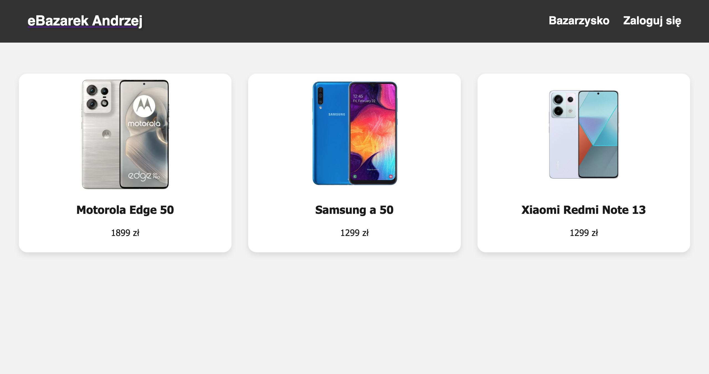
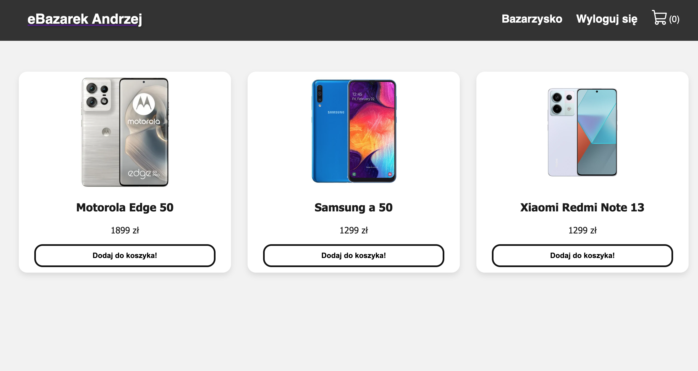
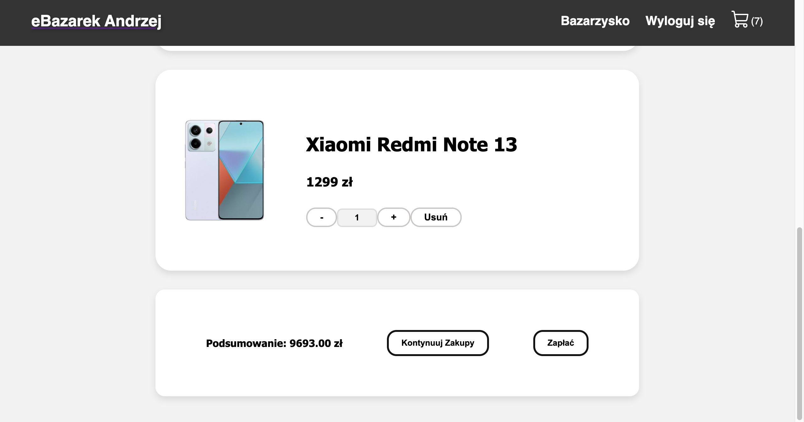
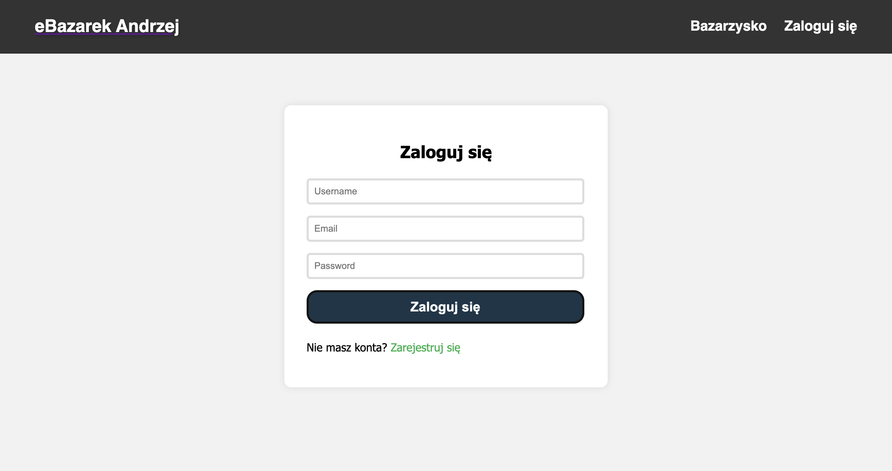
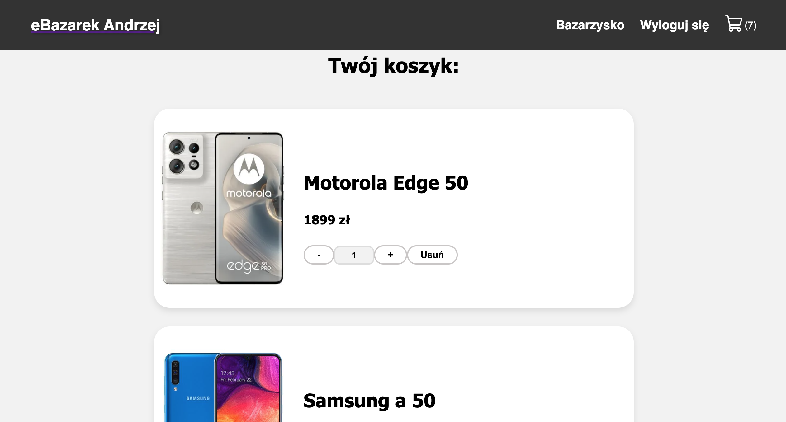
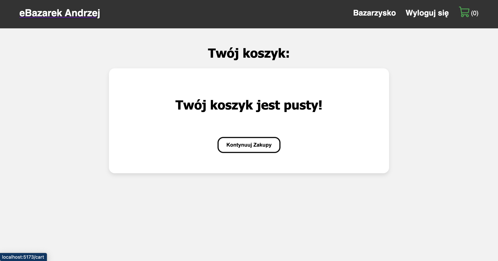
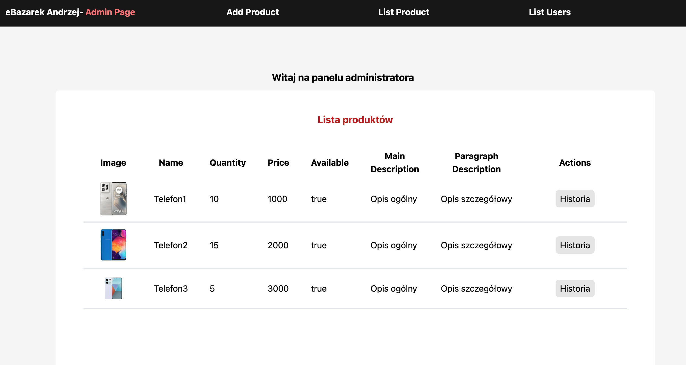
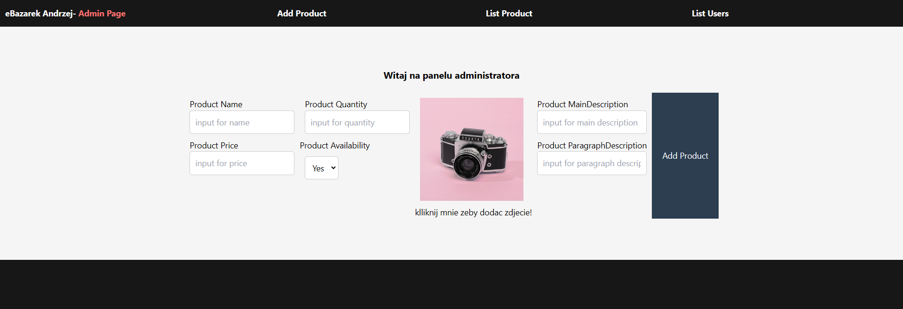
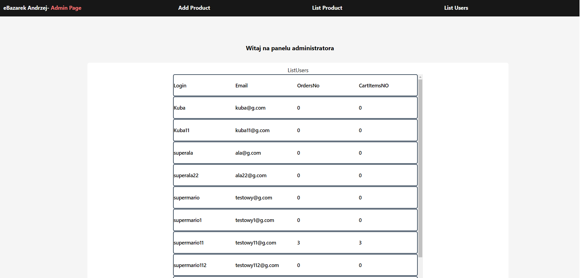

# BD2 mini projekt - sklep internetowy

Skład grupy (imiona i nazwiska, adresy email):

- Bartłomiej Szubiak bszubiak@student.agh.edu.pl
- Szymon Kubiczek kubiczek@student.agh.edu.pl
- Konrad Armatys karmatys@student.agh.edu.pl

Temat (tytuł) projektu: Sklep internetowy

Informacje o wykorzystywanym SZBD i technologii realizacji projektu

- baza danych: `MongoDB`
- backend: `Node.js` , `Express.js`
- obsługa zapytań: `mongoose`
- frameworki\middleware dla backend'u: `multer` , `cors` , `bcrypt`, `jsonwebtoken`, `async-mutex`,  
- (security: `helmet`, `hpp`, `express-mongo-sanitize`, `xss-clean`)
- frontend: `React`

[Link do repozytorium](https://github.com/Simsoftcik/BD2Projekt)

## Opis bazy danych

Baza ma implementować prosty sklep internetowy, w tym celu korzystamy z mongoDB.

### Kolekcje

Poniżej został pokazane przykładowe dokumenty dla każdej z kolekcji.

#### Kolekcja users

```js
{
	_id: 0,
	customerData: {
		firstName: "Jan",
		lastName: "Kowalski",
		phone: "123456789",
		address:{
			country: "Poland",
			postalCode: "12-345",
			region: "Śląsk",
			city: "Katowice",
			street: "Mariacka",
			buildingNumber: "9",
			apartmentNumber: ""
		}
	},
	login: "janekJanek",
	email: "janekJanek@gmail.com",
	password: hashedPassword,
	cartData: [
		{
			productId: 4,
			quantity: 8
		},
	]
	orders: [{
		_id:0,
		date: new Date("2024-05-12"),
		paymentStatus: "confirmed",
		products: [
			{
				productId: 1,
				quantity: 5
			},
			{
				productId: 10,
				quantity: 1
			},
		],
		totalPrice: 100
	}]
}

```

#### Kolekcja products

```js
{
	_id: 10,
	name: "motorola moto g60",
	quantity: 15,
	price: 900.00,
	productDetails: {
		mainDescription: "Telefon jakich mało",
		paragraphDescription: "Dobra bateria, 128GB pamięci...",
	}
	imageUrl: "urlDoZdjęcia",
	available: true
}
```

#### Kolekcja salesHistory

```js
{
	productId: 10,
	quantity: 5,
	date: new Date("2024-05-12"),
	price: 10.00
}
```

### Charakterystyka bazy

Baza danych pozwala na łatwe odczytanie historii produktu oraz historii klienta kosztem pamięci jednego dokumentu.

Baza danych jest łatwa w modyfikowaniu i utrzymywaniu w przyszłości.

## Modele

By zapewnić jednolitą postać danych w bazie danych, zaprojektowaliśmy modele, korzystając z biblioteki Mongoose.

___

### ProductSchema (kolekcja products)

```js
name: `String`, required, unique
quantity: `Number`, required
price: `Number`, required
productDetails: required
	mainDescription: `String`, required, maxLength=100
	paragraphDescription: `String`, required, maxLength=100
imageUrl: `String`, required
available: `Boolean`, default=true
```

#### Implementacja
>Stałe
>
> `regularStringLength`: Ta stała definiuje maksymalną długość dozwoloną dla zwykłych stringów w różnych polach schematu, ustawioną na 100 znaków.
> 
> `regularMessageStringLength`: Ten szablon stringu konstruuje komunikat walidacyjny, który wskazuje, że string nie może być dłuższy niż regularStringLength.
> 
> ```js
> const regularStringLength = 100;
> const regularMessageStringLength = `cannot be longer than ${regularStringLength} characters`;
> ```
>
> 
> 
> 
> 
> ```js
> const ProductSchema = new mongoose.Schema({
>     name: {
>         type: String,
>         required: true,
>         unique: true,
>         maxLength: [regularStringLength, regularMessageStringLength]
>     },
>     quantity: {
>         type: Number,
>         required: true,
>         validate: {
>             validator: function (quantity){
>                 return Number.isInteger(quantity) && quantity >= 0 ;
>             },
>             message: props => `${props.value} quantity should be positive and have Integer value`
>         }
>     },
>     price: {
>         type: Number,
>         required: true,
>         validate: [
>             {
>                 validator: function (price){
>                     return price > 0 ;
>                 },
>                 message: props => `${props.value} is less than 0! Price should be positive`
>             },
>             {
>                 validator: function(price) {
>                     return Number(price.toFixed(2)) === price;
>                 },
>                 message: props => `${props.value} has more than 2 decimal places! Price should have at most 2 decimal places`
>             }
>         ]
>     },
>     productDetails: {
>         type:
>             {
>                 mainDescription: {
>                     type: String,
>                     required: true,
>                     maxLength: [regularStringLength, regularMessageStringLength]
>                 },
>                 paragraphDescription: {
>                     type: String,
>                     required: true,
>                     maxLength: [regularStringLength, regularMessageStringLength]
>                 }
>             },
>         required: true},
>     imageUrl: {type: String, required: true},
>     available: {type: Boolean, default: true},
> });
> ```
> 
> ## Pola
> 
> - `name`: Jest to nazwa produktu. Jest to pole wymagane i musi być unikalne. Maksymalna długość wynosi 100 znaków.
> - `quantity`: Reprezentuje ilość dostępnych produktów. Jest to pole wymagane i musi być liczbą całkowitą większą lub równą 0.
> - `price`: Reprezentuje cenę produktu. Jest to pole wymagane i musi być dodatnią liczbą z co najwyżej 2 miejscami po przecinku.
> - `productDetails`: Jest to obiekt zawierający szczegółowe informacje o produkcie. Składa się z dwóch pól: `mainDescription` i `paragraphDescription`, które są wymagane i mają maksymalną długość 100 znaków.
> - `imageUrl`: Jest to URL do obrazu produktu. Jest to pole wymagane.
> - `available`: Jest to pole określające, czy produkt jest dostępny. Domyślnie jest ustawione na `true`.
> 
> Model `Product` jest eksportowany na końcu pliku i może być importowany w innych częściach aplikacji w razie potrzeby.~~~~~~~~
___

### UserSchema (kolekcja users)

```js
customerData:
	firstName: `String`, maxLength=50
	lastName: `String`, maxLength=50
	phone: `String`
	address:
		country: `String`, maxLength=50
		postalCode: `String`, maxLength=50
		region: `String`, maxLength=50
		city: `String`, maxLength=50
		street: `String`, maxLength=50
		buildingNumber: `String`, maxLength=50
		apartmentNumber: `String`, maxLength=50
login: `String`, required, unique
email: `String`, required, unique
password: `String`, required
[cartData]: default=[]
  productId: `ObjectId`, required
  quantity: `Number`, required, min=1
[orders]: default=[]
  date: `Date`, required, default=Date.now()
    paymentStatus: `String`, required, enum=['Paid', 'Pending', 'Failed']
    products: required
      productId: `ObjectId`, required
    quantity: `Number`, required, min=1
  totalPrice: `Number`
```

### Implementacja
> 
> ## Stałe
> 
> `regularStringLength`: Ta stała definiuje maksymalną długość dozwoloną dla zwykłych stringów w różnych polach schematu, ustawioną na 50 znaków.
> 
> `regularMessageStringLength`: Ten szablon stringu konstruuje komunikat walidacyjny, który wskazuje, że string nie może być dłuższy niż regularStringLength.
> 
> ```js
> const regularStringLength = 50;
> const regularMessageStringLength = `cannot be longer than ${regularStringLength} characters`;
> ````
> 
> 
> ## Schematy
> ### AddressSchema
> AddressSchema definiuje strukturę adresu z kilkoma polami:
> 
> `country`: String z maksymalną długością 50 znaków.
> 
> `postalCode`: String z maksymalną długością 50 znaków.
> 
> `region`: String z maksymalną długością 50 znaków.
> 
> `city`: String z maksymalną długością 50 znaków.
> 
> `street`: String z maksymalną długością 50 znaków.
> 
> `buildingNumber`: String z maksymalną długością 50 znaków.
> 
> `apartmentNumber`: String z maksymalną długością 50 znaków, może być null.
> 
> ```js
> const AddressSchema = new Schema({
>     country: {
>         type: String,
>         maxlength: [regularStringLength, `country ${regularMessageStringLength}`]
>     },
>     postalCode: {
>         type: String,
>         maxlength: [regularStringLength, `postalCode ${regularMessageStringLength}`]
>     },
>     region: {
>         type: String,
>         maxlength: [regularStringLength, `region ${regularMessageStringLength}`]
>     },
>     city: {
>         type: String,
>         maxlength: [regularStringLength, `city ${regularMessageStringLength}`]
>     },
>     street: {
>         type: String,
>         maxlength: [regularStringLength, `street ${regularMessageStringLength}`]
>     },
>     buildingNumber: {
>         type: String,
>         maxlength: [regularStringLength, `buildingNumber ${regularMessageStringLength}`]
>     },
>     apartmentNumber: {
>         type: String,
>         maxlength: [regularStringLength, `apartmentNumber ${regularMessageStringLength}`]
>     } // nullable
> });
> 
> ```
> 
> 
> 
> ### CustomerDataSchema
> 
> CustomerDataSchema definiuje strukturę danych klienta:
> 
> `firstName`: String z maksymalną długością 50 znaków.
> 
> `lastName`: String z maksymalną długością 50 znaków.
> 
> `phone`: String walidowany za pomocą wyrażenia regularnego, aby pasował do międzynarodowych numerów telefonów.
> 
> `address`: Zagnieżdżony schemat dla szczegółów adresu używający AddressSchema.
> 
> ```js
> const CustomerDataSchema = new Schema({
>     firstName: {
>         type: String,
>         maxlength: [regularStringLength, `firstName ${regularMessageStringLength}`]
>     },
>     lastName: {
>         type: String,
>         maxlength: [regularStringLength, `lastName ${regularMessageStringLength}`]
>     },
>     phone: {
>         type: String,
>         validate: /^\+(?:[0-9] ?){6,14}[0-9]$/
>     },
>     address: {
>         type: AddressSchema
>     }
> });
> ```
> 
> ### CartItemSchema
> 
> CartItemSchema definiuje strukturę elementu koszyka:
> 
> `productId`: ID obiektu referencjonujące produkt, wymagane.
> 
> `quantity`: Liczba z minimalną wartością 1, walidowana, aby była liczbą całkowitą, wymagana.
> 
> 
> ```js
> const CartItemSchema = new Schema({
>   productId: {
>       type: ObjectId,
>       ref: 'Products',
>       required: true
>   },
>   quantity: {
>       type: Number,
>       min: 1,
>       validate: {
>           validator: Number.isInteger,
>           message: props => `${props.value} is not an integer value`
>       },
>       required: true
>   }
> });
> ```
> 
> 
> 
> ### OrderSchema
> OrderSchema definiuje strukturę zamówienia:
> 
> `date`: Pole daty z domyślną wartością bieżącej daty, wymagane.
> 
> `paymentStatus`: String wskazujący status płatności, wymagany, z dozwolonymi wartościami 'Paid', 'Pending' lub 'Failed'.
> 
> `products`: Tablica elementów koszyka, walidowana, aby upewnić się, że jest przynajmniej jeden produkt, wymagane.
> 
> `totalPrice`: Liczba walidowana, aby była dodatnia i miała maksymalnie 2 miejsca po przecinku.
> 
> ```js
> const OrderSchema = new Schema({
>     date: {
>         type: Date,
>         default: Date.now(),
>         required: true
>     },
>     paymentStatus: {
>         type: String,
>         required: true,
>         enum: ['Paid', 'Pending', 'Failed']
>     },
>     products: {
>         type: [CartItemSchema],
>         required: true,
>         validate: {
>         validator: function (products) {
>         return products.length > 0;
>         },
>         message: props => `Order should have at least one product`
>         }
>     },
>     totalPrice: {
>         type: Number,
>         validate: [
>         {
>         validator: function (price) {
>         return price > 0;
>         },
>         message: props => `${props.value} is less than 0! TotalPrice should be positive`
>         },
>         {
>         validator: function(price) {
>         return Number(price.toFixed(2)) === price;
>         },
>         message: props => `${props.value} has more than 2 decimal places! TotalPrice should have at most 2 decimal places`
>         }
>         ]
>         }
> });
> ```
> 
> 
> 
> 
> ### UserSchema
> UserSchema definiuje główną strukturę użytkownika:
> 
> `customerData`: Zagnieżdżony schemat dla danych klienta używający CustomerDataSchema.
> 
> `login`: String dla loginu użytkownika, wymagany, unikalny, walidowany za pomocą wyrażenia regularnego,
> sklada sie z małych lub dużych liter lub cyfr, jego dlugosc to min 5 znakow.
> 
> `email`: String dla emaila użytkownika, wymagany, unikalny, walidowany za pomocą wyrażenia regularnego,
> zgodnie z formatem adresu email. (np. aaa@g.com)
> 
> `password`: String dla hasła użytkownika, wymagany.
> 
> `cartData`: Tablica elementów koszyka, domyślnie pusta tablica.
> 
> `orders`: Tablica zamówień, domyślnie pusta tablica.
> 
> ```js
> const UserSchema = new Schema({
> customerData: { type: CustomerDataSchema }, 
>     login: {
>     type: String,
>     required: true,
>     unique: true,
>     validate: /^[a-zA-Z0-9]{5,}$/
> },
> email: {
>     type: String,
>     required: true,
>     unique: true,
>     validate: /^[a-zA-Z0-9._%+-]+@[a-zA-Z0-9.-]+\.[a-zA-Z]{2,}$/
> },
> password: {
>     type: String,
>     required: true
> },
> cartData: {
>     type: [CartItemSchema],
>     default: []
> }, // default to empty array
> orders: {
>     type: [OrderSchema],
>     default: []
> } // default to empty array
> });
> ```
> 
> 
> ### CustomerDataSchema
> 
> CustomerDataSchema definiuje strukturę danych klienta:
> 
> `firstName`: String z maksymalną długością 50 znaków.
> 
> `lastName`: String z maksymalną długością 50 znaków.
> 
> `phone`: String walidowany za pomocą wyrażenia regularnego, aby pasował do międzynarodowych numerów telefonów.
> 
> `address`: Zagnieżdżony schemat dla szczegółów adresu używający AddressSchema.
> 
> ```js
> const CustomerDataSchema = new Schema({
>     firstName: {
>         type: String,
>         maxlength: [regularStringLength, `firstName ${regularMessageStringLength}`]
>     },
>     lastName: {
>         type: String,
>         maxlength: [regularStringLength, `lastName ${regularMessageStringLength}`]
>     },
>     phone: {
>         type: String,
>         validate: /^\+(?:[0-9] ?){6,14}[0-9]$/
>     },
>     address: {
>         type: AddressSchema
>     }
> });
> ```
> 
> ### CartItemSchema
> 
> CartItemSchema definiuje strukturę elementu koszyka:
> 
> `productId`: ID obiektu referencjonujące produkt, wymagane.
> 
> `quantity`: Liczba z minimalną wartością 1, walidowana, aby była liczbą całkowitą, wymagana.
> 
> 
> ```js
> const CartItemSchema = new Schema({
>   productId: {
>       type: ObjectId,
>       ref: 'Products',
>       required: true
>   },
>   quantity: {
>       type: Number,
>       min: 1,
>       validate: {
>           validator: Number.isInteger,
>           message: props => `${props.value} is not an integer value`
>       },
>       required: true
>   }
> });
> ```
> 
> 
> 
> ### OrderSchema
> OrderSchema definiuje strukturę zamówienia:
> 
> `date`: Pole daty z domyślną wartością bieżącej daty, wymagane.
> 
> `paymentStatus`: String wskazujący status płatności, wymagany, z dozwolonymi wartościami 'Paid', 'Pending' lub 'Failed'.
> 
> `products`: Tablica elementów koszyka, walidowana, aby upewnić się, że jest przynajmniej jeden produkt, wymagane.
> 
> `totalPrice`: Liczba walidowana, aby była dodatnia i miała maksymalnie 2 miejsca po przecinku.
> 
> ```js
> const OrderSchema = new Schema({
>     date: {
>         type: Date,
>         default: Date.now(),
>         required: true
>     },
>     paymentStatus: {
>         type: String,
>         required: true,
>         enum: ['Paid', 'Pending', 'Failed']
>     },
>     products: {
>         type: [CartItemSchema],
>         required: true,
>         validate: {
>         validator: function (products) {
>         return products.length > 0;
>         },
>         message: props => `Order should have at least one product`
>         }
>     },
>     totalPrice: {
>         type: Number,
>         validate: [
>         {
>         validator: function (price) {
>         return price > 0;
>         },
>         message: props => `${props.value} is less than 0! TotalPrice should be positive`
>         },
>         {
>         validator: function(price) {
>         return Number(price.toFixed(2)) === price;
>         },
>         message: props => `${props.value} has more than 2 decimal places! TotalPrice should have at most 2 decimal places`
>         }
>         ]
>         }
> });
> ```
> 
> 
> 
> 
> ### UserSchema
> UserSchema definiuje główną strukturę użytkownika:
> 
> `customerData`: Zagnieżdżony schemat dla danych klienta używający CustomerDataSchema.
> 
> `login`: String dla loginu użytkownika, wymagany, unikalny, walidowany za pomocą wyrażenia regularnego,
> sklada sie z małych lub dużych liter lub cyfr, jego dlugosc to min 5 znakow.
> 
> `email`: String dla emaila użytkownika, wymagany, unikalny, walidowany za pomocą wyrażenia regularnego,
> zgodnie z formatem adresu email. (np. aaa@g.com)
> 
> `password`: String dla hasła użytkownika, wymagany.
> 
> `cartData`: Tablica elementów koszyka, domyślnie pusta tablica.
> 
> `orders`: Tablica zamówień, domyślnie pusta tablica.
> 
> ```js
> const UserSchema = new Schema({
> customerData: { type: CustomerDataSchema }, 
>     login: {
>     type: String,
>     required: true,
>     unique: true,
>     validate: /^[a-zA-Z0-9]{5,}$/
> },
> email: {
>     type: String,
>     required: true,
>     unique: true,
>     validate: /^[a-zA-Z0-9._%+-]+@[a-zA-Z0-9.-]+\.[a-zA-Z]{2,}$/
> },
> password: {
>     type: String,
>     required: true
> },
> cartData: {
>     type: [CartItemSchema],
>     default: []
> }, // default to empty array
> orders: {
>     type: [OrderSchema],
>     default: []
> } // default to empty array
> });
> ```

___

### SalesHistorySchema (kolekcja salesHistory)

Ten model reprezentuje historię sprzedaży produktu w aplikacji.

```js
productId: `ObjectId`, required
quantity: `Number`, required, default=1
date: `Date`, required, default=Date.now(), index
price: `Number`, required
userID: `ObjectId`, required
```

#### Implementacja

> ```js
> const ProductSalesHistory = mongoose.model('ProductSalesHistory', {
>     productId: {
>         type: ObjectId,
>         ref: 'Product',
>         required: true
>     },
>     quantity: {
>         type: Number,
>         default: 1 ,
>         required: true,
>         validate: {
>             validator: function(v) {
>                 return v >= 1 && Number.isInteger(v);
>             },
>             message: props => `${props.value} is not a valid quantity! Quantity should be greater than or equal to 1 and have Integer value.`
>         }
>     },
>     date: {
>         type: Date,
>         default: Date.now,
>         required: true,
>         index : true
>     },
>     price: {
>         type: Number,
>         required: true,
>         validate: [
>             {
>                 validator: function (price){
>                     return price > 0 ;
>                 },
>                 message: props => `${props.value} is less than 0! Price should be positive`
>             },
>             {
>                 validator: function(price) {
>                     return Number(price.toFixed(2)) === price;
>                 },
>                 message: props => `${props.value} has more than 2 decimal places! Price should have at most 2 decimal places`
>             }
>         ]
>     },
>     userId: {
>         type: ObjectId,
>         ref: 'User',
>         required: true
>     }
> 
> });
> ```
> 
> ## Pola
> 
> - `productId`: Jest to odniesienie do modelu `Product`. Jest to pole wymagane.
> - `quantity`: Reprezentuje ilość sprzedanego produktu. Domyślnie wynosi 1 i musi być liczbą całkowitą większą lub równą 1.
> - `date`: Reprezentuje datę sprzedaży. Domyślnie jest to bieżąca data i godzina, jest to pole wymagane. Jest również indeksowane dla szybszych zapytań.
> - `price`: Reprezentuje cenę produktu w momencie sprzedaży. Jest to pole wymagane i musi być dodatnią liczbą z co najwyżej 2 miejscami po przecinku.
> - `userId`: Jest to odniesienie do modelu `User`. Reprezentuje użytkownika, który dokonał zakupu. Jest to pole wymagane.
> 


### Walidacja

Wszędzie gdzie było to potrzebne, wyposażaliśmy modele w funkcje walidujące dane.
W przypadku email, phone, year, month sprawdzały one dodatkowo zgodność z ustalonymi wyrażeniami regularnymi

## Endpointy

### Endpointy koszyka

Każda metoda opisana poniżej korzysta z middleware findUser,
który weryfikuje czy użytkownik istnieje i czy podany przez niego token jest poprawny.

#### /cart/own

##### Opis

Zwraca koszyk klienta.

##### Metoda HTTP `GET`

##### Parametry

- \_id `ObjectId`
- _optional_ projection `Projection`

##### Wartość zwracana

```js
{
  success: true,
  cartData: CartItemSchema[],
  totalPrice: number
}
```

---

Parametry zwracane w cartData są zależna od projection.
Pełny typ `CartItemSchema` jest zwracany gdy projection nie zostanie podane.

##### Zwracanie błędu

```js
{
  success: false,
  message: string,
  errors: string
}
```

##### Implementacja

```js
router.get("/own", findUser, async (req, res) => {
  try {
    const cartProjection = req.body.cartProjection || {};
    const userData = await User.findOne(
      { _id: req.user._id },
      { _id: 1, cartData: 1 }
    );

    const cartData = [];
    for (let item of userData.cartData) {
      const dbProduct = await Product.findOne(
        { _id: item.productId },
        cartProjection
      );
      cartData.push({
        productId: item.productId,
        quantity: item.quantity,
        productData: dbProduct,
      });
    }

    res.json({
      success: true,
      cartData: cartData,
    });
  } catch (err) {
    res.status(500).json({
      success: false,
      message: "Error fetching user data from db",
      errors: err,
    });
  }
});
```

#### /cart/updateone

##### Opis

Zmienia dane jednego produktu w koszyku użytkownika.

##### Metoda HTTP `POST`

##### Parametry

- \_id `ObjectId`
- cartProductData `CartItemSchema`

##### Wartość zwracana

```js
{
  success: true,
  message: string,
  newCart: {
    type: [CartItemSchema],
    default: []
  },
  oldCart: {
    type: [CartItemSchema],
    default: []
  }
}
```

##### Zwracanie błędu

```js
{
  success: false,
  message: string,
  errors: string
}
```

##### Implementacja

```js
router.post("/updateone", findUser, async (req, res) => {
  const cartProductData = req.body.cartProductData;
  const userData = req.user;
  if (!cartProductData) {
    return res.status(400).json({
      success: false,
      message: "No cartProductData provided",
      errors: "No cartProductData provided via body",
    });
  }
  if (
    !cartProductData.hasOwnProperty("productId") ||
    !cartProductData.hasOwnProperty("quantity")
  ) {
    return res.status(400).json({
      success: false,
      message: "Mising parameter in cartProductData",
      errors:
        "Parameter 'productId' or 'quantity' not found in cartProductData (body object)",
    });
  }
  if (cartProductData.quantity < 0) {
    return res.status(400).json({
      success: false,
      message: "Bad quantity value",
      errors: "Quantity of product in cart is less than 0",
    });
  }

  try {
    const dbUser = await User.findOne({ _id: userData._id }, { cartData: 1 });
    const oldCart = JSON.parse(JSON.stringify(dbUser.cartData)); // 200 iq deep copy

    if (cartProductData.quantity === 0) {
      // Jeśli produkt ma być usunięty z koszyka

      dbUser.cartData = dbUser.cartData.filter(
        (item) => item.productId.toString() !== cartProductData.productId
      );
    } else {
      //normalna modyfikacja koszyka

      // znajdz produkt w koszyku
      let cartItem = dbUser.cartData.find(
        (item) => item.productId.toString() === cartProductData.productId
      );

      if (cartItem) {
        // Jeśli produkt jest już w koszyku, zaktualizuj ilość
        cartItem.quantity = cartProductData.quantity;
      } else {
        // Jeśli produktu nie ma w koszyku, dodaj go
        cartItem = {
          productId: cartProductData.productId,
          quantity: cartProductData.quantity,
        };
        dbUser.cartData.push(cartItem);
      }

      // sprawdzenie czy produkt mozna kupic w takiej ilosci, i czy jest dostepny
      const dbProduct = await Product.findOne(
        { _id: cartProductData.productId },
        { quantity: 1, available: 1 }
      );

      if (!(cartItem.quantity <= dbProduct.quantity) || !dbProduct.available) {
        return res.status(400).json({
          success: false,
          message:
            "Bad quantity value. Quantity of product in cart is bigger than available in DB. Or product is not available",
          errors: `dbProduct.quantity ${dbProduct.quantity} < ${cartItem.quantity} , dbProduct.available ${dbProduct.available}`,
        });
      }
    }
    // finally
    dbUser.save();
    return res.json({
      success: true,
      message: "Cart updated",
      newCart: dbUser.cartData,
      oldCart: oldCart,
    });
  } catch (err) {
    res.status(500).json({
      success: false,
      message: "Server error probably DB error or bad quantity value",
      errors: err,
    });
  }
});
```

#### /cart/sell

##### Opis

Sprzedaje produkty użytkownikowi z jego koszyka.

---

Aby zachować synchroniczność dostępu do danych używamy mutexa.

##### Metoda HTTP `POST`

##### Parametry

- \_id `ObjectId`

##### Wartość zwracana

```js
{
  success: true,
  message: string,
  totalPrice: number
}
```

##### Zwracanie błędu

```js
{
  success: false,
  message: string,
  errors: string,
  newCart: {
    type: [CartItemSchema],
    default: []
  },
  oldCart: {
    type: [CartItemSchema],
    default: []
  }
}
```

##### Implementacja

```js
router.post("/sell", findUser, async (req, res) => {
  const reqUserData = req.user;
  const release = await verificationMutex.acquire(); //przyblokowanie innych instancji

  const session = await mongoose.startSession();
  session.startTransaction();

  try {
    const dbUser = await User.findOne({ _id: reqUserData._id });
    {
      // verification of cart block
      const { fixedCart, cartError } = await verifyCart(dbUser.cartData);

      if (cartError === true) {
        const oldCart = JSON.parse(JSON.stringify(dbUser.cartData)); // 200 iq deep copy
        dbUser.cartData = fixedCart;
        await dbUser.save({ session });

        release();
        return res.status(400).json({
          success: false,
          message: "Cart verification failed, cart has been fixed",
          errors: "Cart verification failed",
          cartFixed: true,
          newCart: dbUser.cartData,
          oldCart: oldCart,
        });
      }
    }

    // cart verification passed, selling... //TODO add dummy payment ?
    let totalPrice = 0;

    async function updateDbItems() {
      for (let item of dbUser.cartData) {
        const dbProduct = await Product.findOne({ _id: item.productId });
        dbProduct.quantity -= item.quantity;
        totalPrice += item.quantity * dbProduct.price;
        dbProduct.save({ session });

        // create product history
        new ProductSalesHistory({
          productId: item.productId,
          quantity: item.quantity,
          price: dbProduct.price,
          userId: dbUser._id,
        }).save({ session });
      }
    }

    await updateDbItems();

    totalPrice = Number(totalPrice.toFixed(2));

    dbUser.orders.push({
      paymentStatus: "Paid",
      products: dbUser.cartData,
      totalPrice: totalPrice,
    });

    dbUser.cartData = [];
    await dbUser.save({ session });

    await session.commitTransaction();
    await session.endSession();

    res.json({
      success: true,
      message: "Products sold",
      totalPrice: totalPrice,
    });
  } catch (err) {
    await session.abortTransaction();
    await session.endSession();
    res.status(500).json({
      success: false,
      message: "Server error probably DB error",
      errors: err,
    });
  } finally {
    release(); // mutex release
  }
});
```

### Endpointy produktu

#### /products/list

##### Opis

Zwraca wszystkie produkty.

##### Metoda HTTP `GET`

##### Parametry

- \_id `ObjectId`

##### Wartość zwracana

```js
{
  success: true,
  products: CartItemSchema[]
}
```

##### Zwracanie błędu

```js
{
  success: false,
  message: string,
  errors: string
}
```

##### Implementacja

```js
router.get("/list", async (req, res) => {
  const projection = req.body.projection || {};
  const filter = req.body.filter || {};
  try {
    const products = await Product.find(filter, projection);

    return res.json({
      success: true,
      products: products,
    });
  } catch (err) {
    return res.status(500).json({
      success: false,
      message: "Failed to query from db:" + err.message,
      errors: err,
    });
  }
});
```

#### /products/available

##### Opis

Zwraca wszystkie dostępne produkty.

##### Metoda HTTP `GET`

##### Parametry

- \_id `ObjectId`

##### Wartość zwracana

```js
{
  success: true,
  products: CartItemSchema[]
}
```

##### Zwracanie błędu

```js
{
  success: false,
  message: string,
  errors: string
}
```

##### Implementacja

```js
router.get("/available", async (req, res) => {
  const projection = req.body.projection || {};
  try {
    const products = await Product.find(
      { available: true, quantity: { $gt: 0 } },
      projection
    );
    return res.json({
      success: true,
      products: products,
    });
  } catch (err) {
    return res.status(500).json({
      success: false,
      message: "Failed to query from db:" + err.message,
      errors: err,
    });
  }
});
```

#### /products/add

##### Opis

Dodaje nowy produkt.

---

Przed wykonaniem sprawdzamy przy pomocy middlewaru validateBodyJsonSchema czy dane nowego produktu są poprawne.

##### Metoda HTTP `POST`

##### Parametry

- \_id `ObjectId`
- newProduct `productSchema`

##### Wartość zwracana

```js
{
  success: true,
  message: string,
  name: string
}
```

##### Zwracanie błędu

```js
{
  success: false,
  message: string,
  errors: string
}
```

##### Implementacja

```js
router.post(
  "/add",
  validateBodyJsonSchema("newProduct", Product),
  async (req, res) => {
    const reqProduct = req.body.newProduct;
    try {
      const isAlreadyInDB = await Product.findOne({ name: reqProduct.name });
      if (isAlreadyInDB) {
        return res.status(409).json({
          success: false,
          message: "Product already in DB with that name",
          errors: `When trying to add ${reqProduct} found already ${isAlreadyInDB} in DB`,
        });
      }

      const product = new Product(reqProduct);
      await product.save();
      return res.json({
        success: true,
        message: "Product saved",
        name: req.body.name,
      });
    } catch (err) {
      return res.status(500).json({
        success: false,
        message: "Failed to save to db",
        errors: err,
      });
    }
  }
);
```

#### /products/get/:id

##### Opis

Dodaje nowy produkt.

---

Przed wykonaniem sprawdzamy przy pomocy middlewaru validateBodyJsonSchema czy dane nowego produktu są poprawne.

##### Metoda HTTP `GET`

##### Parametry

- \_id `ObjectId`
- _optional_ projection `Projection`

##### Wartość zwracana

```js
{
  success: true,
  message: string,
  product: {
    _id: ObjectId,
    name: string,
    quantity: number,
    price: number,
    productDetails: {
      mainDescription: string,
      paragraphDescription: string,
    },
    imageUrl: string,
    available: boolean,
  }
}
```

---

Wartość zwracana jest zależna od projection.
Powyżej znajdują się dane otrzymane gdy projection nie zostanie podane.

##### Zwracanie błędu

```js
{
  success: false,
  message: string,
  errors: string
}
```

##### Implementacja

```js
router.get("/get/:id", async (req, res) => {
  const projection = req.body.projection || {};
  const id = req.params.id;
  try {
    const product = await Product.findOne({ _id: id }, projection);

    if (!product) {
      res.status(404).json({
        success: false,
        message: "Product not found in DB",
        errors: "Product with that _id not found in DB",
      });
    }

    return res.json({
      success: true,
      message: "Product found",
      product: product,
    });
  } catch (err) {
    return res.status(500).json({
      success: false,
      message: "Failed to query from db, db not working or bad projection",
      errors: err,
    });
  }
});
```

### Endpointy użytkownika

#### /users/list

##### Opis

Zwraca wszystkich użytkowników.

##### Metoda HTTP `GET`

##### Parametry

- _optional_ projection `Projection`
- _optional_ filter `Filter`

##### Wartość zwracana

```js
{
  success: true,
  products: [
    {
      _id: ObjectId,
      customerData: {
        firstName: string,
        lastName: string,
        phone: string,
        address: {
          country: string,
          postalCode: string,
          region: string,
          city: string,
          street: string,
          buildingNumber: string,
          apartmentNumber: string
        }
      },
      login: string,
      email: string,
      password: encodedPassword,
      cartData: {
        productId: number
        quantity: number
      }
      orders: {
        _id: ObjectId,
        date: Date,
        paymentStatus: string,
        products: [
          {
            productId: number,
            quantity: number
          },
          {
            productId: number,
            quantity: number
          },
        ],
        totalPrice: number
      }
    }
  ]
}
```

---

Wartość zwracana jest zależna od projection.
Powyżej znajdują się dane otrzymane gdy projection nie zostanie podane.

##### Zwracanie błędu

```js
{
  success: false,
  message: string,
  errors: string
}
```

##### Implementacja

```js
router.get("/list", async (req, res) => {
  const projection = req.body.projection || {};
  const filter = req.body.filter || {};

  try {
    const fetchedUsers = await User.find(filter, projection);
    res.json(fetchedUsers);
  } catch (err) {
    res.status(500).json({
      success: false,
      message: "Failed to query from db:" + err.message,
      errors: err,
    });
  }
});
```

#### /users/add

##### Opis

Dodaje nowego użytkownika.

##### Metoda HTTP `POST`

##### Parametry

- user `UserSchema`

##### Wartość zwracana

```js
{
  success: true,
  message: string,
  user: {
    _id: ObjectId,
    customerData: {
      firstName: string,
      lastName: string,
      phone: string,
      address: {
        country: string,
        postalCode: string,
        region: string,
        city: string,
        street: string,
        buildingNumber: string,
        apartmentNumber: string
      }
    },
    login: string,
    email: string,
    password: encodedPassword,
    cartData: {
      productId: number
      quantity: number
    }
    orders: {
      _id: ObjectId,
      date: Date,
      paymentStatus: string,
      products: [
        {
          productId: number,
          quantity: number
        },
        {
          productId: number,
          quantity: number
        },
      ],
      totalPrice: number
    }
  }
}
```

##### Zwracanie błędu

```js
{
  success: false,
  message: string,
  errors: string
}
```

##### Implementacja

```js
router.post("/add", async (req, res) => {
  try {
    const userData = req.body.user; //as in schema
    const result = await addNewUser(userData);
    if (result.success === true) {
      return res.json(result);
    } else {
      return res.status(400).json(result);
    }
  } catch (err) {
    return res.status(500).json({
      success: false,
      message: "Failed to add user" + err.message,
      errors: err,
    });
  }
});
```

#### /users/signup

##### Opis

Rejestruje nowego użytkownika.

##### Metoda HTTP `POST`

##### Parametry

- user `UserSchema`

##### Wartość zwracana

```js
{
  success: true,
  token: token,
  user: {
    _id: ObjectId,
    login: string,
    email: string
  }
}
```

##### Zwracanie błędu

```js
{
  success: false,
  message: string,
  errors: string
}
```

##### Implementacja

```js
router.post("/signup", async (req, res) => {
  try {
    const userData = req.body.user; //as in schema
    const addUserResult = await addNewUser(userData);
    if (addUserResult.success === false) {
      return res.status(400).json(addUserResult);
    }
    const user = addUserResult.user;

    const token = getUserToken(user);
    return res.json({
      success: true,
      token: token,
      user: {
        _id: user._id,
        login: user.login,
        email: user.email,
      },
    });
  } catch (err) {
    return res.status(500).json({
      success: false,
      message: "Failed to sign up user" + err.message,
      errors: err,
    });
  }
});
```

#### /users/login

##### Opis

Loguje użytkownika.

##### Metoda HTTP `POST`

##### Parametry

- user `UserSchema`

##### Wartość zwracana

```js
{
  success: true,
  token: token,
  user: {
    _id: ObjectId,
    login: string,
    email: string
  }
}
```

##### Zwracanie błędu

```js
{
  success: false,
  message: string,
  errors: string
}
```

##### Implementacja

```js
router.post("/login", async (req, res) => {
  try {
    const userData = req.body.user; //as in schema

    let dbUser = undefined;
    if (userData.login) {
      dbUser = await User.findOne(
        { login: userData.login },
        { login: 1, email: 1, password: 1 }
      );
    } else if (userData.email) {
      dbUser = await User.findOne(
        { email: userData.email },
        { login: 1, email: 1, password: 1 }
      );
    }

    if (!dbUser) {
      return res.status(400).json({
        success: false,
        message: `${
          userData.login
            ? "User with that login does not exist"
            : "User with that email does not exist"
        }`,
        errors: "User does not exist",
      });
    }

    // const passwordCompare = dbUser.password === userData.password
    const passwordCompare = await bcrypt.compare(
      userData.password,
      dbUser.password
    );

    if (passwordCompare) {
      const token = getUserToken(dbUser);
      res.json({
        success: true,
        token: token,
        user: {
          _id: dbUser._id,
          login: dbUser.login,
          email: dbUser.email,
        },
      });
    } else {
      res.status(400).json({
        success: false,
        message: "Invalid password",
        errors: "Invalid password",
      });
    }
  } catch (err) {
    res.status(500).json({
      success: false,
      message: "Failed to log in user" + err.message,
      errors: err,
    });
  }
});
```

### Endpointy historii sprzedaży

#### /salesHistory/get/:id

##### Opis

Zwraca historię sprzedaży konkretnego produktu.

##### Metoda HTTP `GET`

##### Parametry

- _optional_ salesProjection `Projection`
- _optional_ salesFilter `Filter`
- _optional_ productProjection `Projection`

##### Wartość zwracana

```js
{
  success: true,
  message: string,
  products: CartItemSchema,
  salesHistory: SalesHistorySchema[]
}
```

---

Wartość zwracana jest zależna od projection.
Powyżej znajdują się dane otrzymane gdy projection nie zostanie podane.

##### Zwracanie błędu

```js
{
  success: false,
  message: string,
  errors: string
}
```

##### Implementacja

```js
router.get("/get/:id", async (req, res) => {
  const salesProjection = req.body.salesProjection || {};
  const salesFilter = req.body.salesFilter || {};
  const productProjection = req.body.productProjection || {};

  const id = req.params.id;

  try {
    const dbProduct = await Product.findOne({ _id: id }, productProjection);

    if (!dbProduct) {
      return res.status(404).json({
        success: false,
        message: "Product not found in DB",
        errors: "Product with that _id not found in DB",
      });
    }

    const dbSalesHistory = await ProductSalesHistory.find(
      { productId: id, ...salesFilter },
      salesProjection
    );
    return res.json({
      success: true,
      message: "Product and sales history found",
      product: dbProduct,
      salesHistory: dbSalesHistory,
    });
  } catch (err) {
    return res.status(500).json({
      success: false,
      message: "Failed to query from db, db not working or bad projection",
      errors: err,
    });
  }
});
```

#### /totalEarned/:id

##### Opis

Zwraca łączną zarobioną kwotę przez konkretny produkt.

##### Metoda HTTP `GET`

##### Wartość zwracana

```js
{
  success: true,
  message: string,
  totalEarned: number
}
```

##### Zwracanie błędu

```js
{
  success: false,
  message: string,
  errors: string
}
```

##### Implementacja

```js
router.get("/totalEarned/:id", async (req, res) => {
  const id = req.params.id;

  try {
    const dbSalesHistory = await ProductSalesHistory.find({ productId: id });
    let totalEarned = 0;
    dbSalesHistory.forEach((sale) => {
      totalEarned += sale.price * sale.quantity;
    });

    totalEarned = Number(totalEarned.toFixed(2));
    return res.json({
      success: true,
      message: "Total earned for product",
      totalEarned: totalEarned,
    });
  } catch (err) {
    return res.status(500).json({
      success: false,
      message: "Failed to query from db.",
      errors: err,
    });
  }
});
```

## Metody pomocnicze

#### addNewUser

##### Opis

Dodaje użytkownika do bazy.

##### Parametry

- userData `UserSchema`

##### Wartość zwracana

```js
{
  success: true,
  message: string,
  user: {
    _id: ObjectId,
    customerData: {
      firstName: string,
      lastName: string,
      phone: string,
      address: {
        country: string,
        postalCode: string,
        region: string,
        city: string,
        street: string,
        buildingNumber: string,
        apartmentNumber: string
      }
    },
    login: string,
    email: string,
    password: encodedPassword,
    cartData: {
      productId: number
      quantity: number
    }
    orders: {
      _id: ObjectId,
      date: Date,
      paymentStatus: string,
      products: [
        {
          productId: number,
          quantity: number
        },
        {
          productId: number,
          quantity: number
        },
      ],
      totalPrice: number
    }
  }
}
```

##### Zwracanie błędu

```js
{
  success: false,
  message: string,
  errors: string
}
```

##### Implementacja

```js
async function addNewUser(userData) {
  let isUserExist;
  try {
    isUserExist = await User.findOne({ email: userData.email }, { login: 1 });
  } catch (err) {
    return {
      success: false,
      message: "Failed to query from db to check if user exist" + err.message,
      errors: err,
    };
  }

  if (isUserExist) {
    return {
      success: false,
      message: "User with that email already exists",
      errors: "User already exists",
    };
  }
  try {
    // Hash the password
    const salt = await bcrypt.genSalt(10);
    // Replace the plain text password with the hashed password
    userData.password = await bcrypt.hash(userData.password, salt);

    const user = new User(userData);
    const savedUser = await user.save();
    return {
      success: true,
      message: "User has been created",
      user: savedUser,
    };
  } catch (err) {
    return {
      success: false,
      message:
        "Failed to create or add user, bad data provided probably " +
        err.message,
      errors: err,
    };
  }
}
```

#### getUserToken

##### Opis

Generuje token użytkownikowi.

##### Parametry

- user `UserSchema`

##### Wartość zwracana

`string`

##### Implementacja

```js
function getUserToken(user) {
  const jwt_data = {
    //data for jwt (json web token)
    user: { _id: user._id },
  };
  return jwt.sign(jwt_data, userEncodePass);
}
```

#### getUserByToken

##### Opis

Zwraca użytkownika (jako tylko jego _id) na podstawie tokenu.

##### Parametry

- token `string`

##### Wartość zwracana

```js
{
  _id: ObjectId
}
```

##### Implementacja

```js
function getUserByToken(token) {
  const decoded = jwt.verify(token, userEncodePass);
  return decoded.user;
}
```

#### findUser

##### Opis

Próbuje odnalesc uzytkownika na podstawie tokenu. Bądź na podstawie danych z body.
Sprawdza czy użytkownik istnieje w bazie i czy jego token jest poprawny.

##### Parametry

- req `Request`
- res `Response`
- next `Function`

##### Wartość zwracana

`undefined`

##### Zwracanie błędu

```js
{
  success: false,
  message: string,
  errors: string
}
```

##### Implementacja

```js
export const findUser = async (req, res, next) => {
  const reqUser = req.body.user;
  if (reqUser && reqUser._id) {
    // by passing user auth
    if (!User.exists({ _id: reqUser._id })) {
      return res.status(404).json({
        success: false,
        message: "That user does not exist in db",
        errors: `User with provided _id: ${reqUser._id} does not exist in db`,
      });
    } else {
      return next();
    }
  }

  const token = req.header("user-auth-token");
  if (!token) {
    return res.status(401).json({
      success: false,
      errors: "No token found, authorization denied",
      message: "Authenticate using a valid token",
    });
  }

  try {
    const user = getUserByToken(token);

    if (!User.exists({ _id: user._id })) {
      res.status(404).json({
        success: false,
        message: "That user does not exist in db",
        errors: `User with provided _id: ${user._id} does not exist in db`,
      });
    }

    // req.user = getUserByToken(token)
    req.user = user;
    next();
  } catch (err) {
    res.status(400).json({
      success: false,
      errors: err,
      message: "Provided token is not valid",
    });
  }
};
```

#### verifyCart

##### Opis

Sprawdza czy koszyk jest poprawny. 
Tzn. czy dla każdego produktu w koszyku jest wystarczająca ilość w magazynie, oraz czy produkt jest dostępny.
Jeśli koszyk był niepoprawny, to go naprawia, usuwając produkty bądź zmieniając ich ilość.
Sygnalizuje czy podany koszyk jest poprawny. Powinna być używana przed sprzedażą produktów oraz synchronicznie.

##### Parametry

- cartData `CartItemSchema[]`

##### Wartość zwracana

```js
{
  fixedCart: [
    {
      productId: number,
      quantity: number
    }
  ],
  cartError: false
}
```

##### Zwracanie błędu

```js
{
  fixedCart: [
    {
      productId: number,
      quantity: number
    }
  ],
  cartError: true
}
```

##### Implementacja

```js
async function verifyCart(cartData) {
  const fixedCart = [];
  let cartError = false;

  for (let item of cartData) {
    const dbProduct = await Product.findOne({ _id: item.productId });
    if (dbProduct.available === false) {
      // remove from cart
      cartError = true;
      continue;
    }

    if (dbProduct.quantity < item.quantity) {
      // fix quantity
      cartError = true;
      item.quantity = dbProduct.quantity;
      fixedCart.push(item);
    } else {
      // normal
      fixedCart.push(item);
    }
  }
  return {
    fixedCart: fixedCart,
    cartError: cartError,
  };
}
```

#### validateBodyJsonSchema

##### Opis

Middleware który sprawdza czy request.body posiada daną strukturę.

##### Parametry

- bodyFieldName `string`
- schema `Function`

##### Wartość zwracana

`undefined`

##### Zwracanie błędu

```js
{
  success: false,
  message: string,
  errors: string
}
```

##### Implementacja

```js
const validateBodyJsonSchema = (bodyFieldName, schema) => {
  return (req, res, next) => {
    if (!req.body.hasOwnProperty(bodyFieldName)) {
      return res.status(400).json({
        success: false,
        message: "Missing required field in JSON body",
        errors: `Missing required field: ${bodyFieldName}`,
      });
    }

    try {
      const isValid = new schema(req.body[bodyFieldName]);
    } catch (error) {
      return res.status(400).json({
        success: false,
        message: "Invalid given JSON structure",
        errors: error,
      });
    }
    next();
  };
};
```

## Frontend

Przy pomocy biblioteki React stworzyliśmy dwie strony internetowe- jedną dla uzytkownika, która pobiera dane z endpointów i umożliwia:

- rejestrację i logowanie się
- przeglądanie produktów
- dodawanie i usuwanie produktów z koszyka (po zalogowaniu)
- symboliczny zakup produktów z koszyka
  Oraz drugą dla administratora, za pomocą której mozna:
- sprawdzać bazę użytkowników
- dodawanie oraz usuwanie produktów
- sprawdzanie historii produktu

### Sklep internetowy- zdjęcia

#### Strona wyboru produktu



#### Strona wyboru produktu (po zalogowaniu)



#### Szczegółowy widok produktu



#### Panel logowania



#### Koszyk



#### Koszyk (pusty)



### Panel administratora - zdjęcia

#### Panel administratora (listowanie produktów)



#### Dodawanie produktu



#### Lista użytkowników


