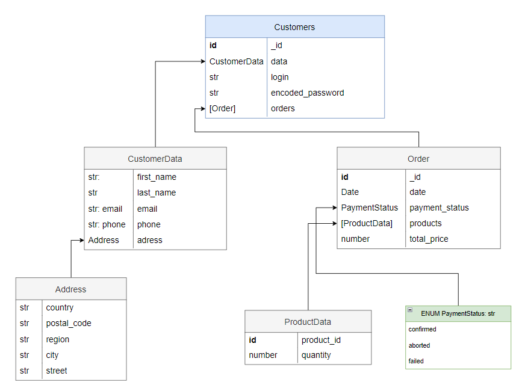

# Opis bazy danych v1

Baza ma implementować prosty sklep internetowy, więc:

## Schematy tabel (dokumentów):

Dodatkowe informacje:

- `niebieskim` kolorem zaznaczono **tablele**
- `szarym` **obiekty** potrzebne do realizacji innych
- `zielonym`**enumy**
  (obiekty które moga tylko przymować określone z góry postacie)
- relacje obiektów na diagramie UML zaznaczono za pomoca strzałek

> Tabela Customers
>
> 

> Tabela Products
>
> 

## Operacje CRUD na bazie danych które bedą implementowane:

1. Operacje dotyczące tylko tabeli Customers:

   - `addCustomer`dodająca klienta do bazy danych
     _(potrzebne przy tworzeniu konta)_
   - `checkIfCustomerExist`sprawdzajaca czy klient o danym loginie i hasle istnieje _(potrzebne do logowania)_

2. Operacje dotyczące tylko tabeli Products:

   - `addProduct` dodająca nowy produkt

3. Operacje dotyczące obu tabel:

   - `sellProductsTo` sprzedająca klientowi produkty (z koszyka)

     - dla kazdego produktu w sklepie zmniejsza ich ilosc sprawdzajac czy produkty mozna kupic (czy jest ich na tyle oraz czy sa dostepne)

     - rejestruje zakup produktu dla produktu (event = sold)
     - rejestruje zamowienie u klienta (order)

## Dodatkowe informacje

Baza danych pozwala na łatwe odczytanie histori produktu oraz histori klienta, kosztem pamięci

Baza danych jest łatwo modyfikowalna i utrzymywalna w przyszłości
